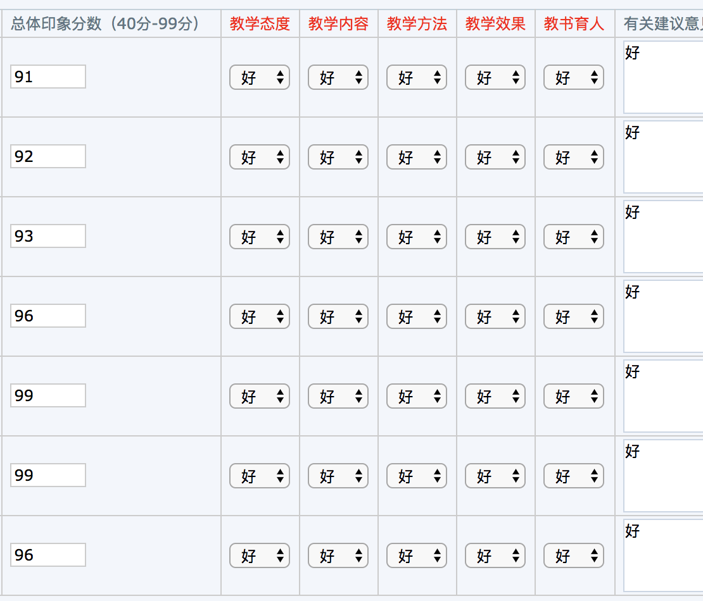

# 简介

PPSUC正方教务管理系统一键评教工具

# 使用方法

**环境要求：** 系统不限，**chrome浏览器**

**使用步骤**：

* 1.下载插件：(点击首页的auto-evaluation.crx文件(或直接打开文件下载链接：[下载页面](https://github.com/jerryOnlyZRJ/auto-evalutaion/blob/master/auto-evaluation.crx)) -> 点击 `View Raw` ，文件会自动下载到你的电脑上)

* 2.点击chrome浏览器右上角的菜单栏找到扩展程序：

  

* 3.将你刚刚下载的插件文件拖拽进页面即可

* 4.打开评价页面，自动完成评教。

